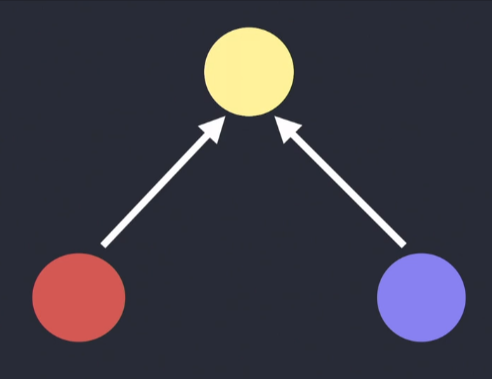
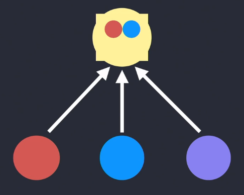
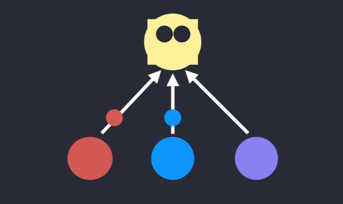
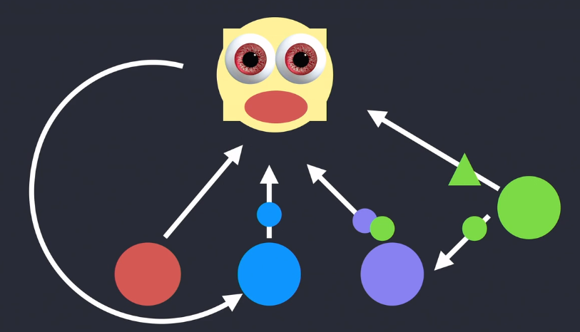

# Dev Guide - WIP
Developer Guide picked up from blogs, books, videos, and preferences. Includes code style, practical wisdom, and things I enjoy using to perform the job. Please note a lot of this content is taken directly from others who have spent far more time on it than myself. Please see bottom for references. 

## Naming Convention

camelCase naming convention
- fooBar.js
- let fooBar

### File Naming
  
separate file details by period
- fooBar.test.js
- fooBar.helper.js

use eslint unicorn for file naming enforcement
```js
"unicorn/filename-case": [
	"error",
	{
		"cases": {
			"camelCase": true,
			"pascalCase": true
		}
	}
]
```
---

### Variable Naming
#### S-I-D

A name must be _short_, _intuitive_ and _descriptive_:

- **Short**. A name must not take long to type and, therefore, remember;
- **Intuitive**. A name must read naturally, as close to the common speech as possible;
- **Descriptive**. A name must reflect what it does/possesses in the most efficient way.

```js
/* Bad */
const a = 5 // "a" could mean anything
const isPaginatable = a > 10 // "Paginatable" sounds extremely unnatural
const shouldPaginatize = a > 10 // Made up verbs are so much fun!

/* Good */
const postCount = 5
const hasPagination = postCount > 10
const shouldPaginate = postCount > 10 // alternatively
```

#### Avoid contractions

Do **not** use contractions. They contribute to nothing but decreased readability of the code. Finding a short, descriptive name may be hard, but contraction is not an excuse for not doing so.

```js
/* Bad */
const onItmClk = () => {}

/* Good */
const onItemClick = () => {}
```

#### Avoid context duplication

A name should not duplicate the context in which it is defined. Always remove the context from a name if that doesn't decrease its readability.

```js
class MenuItem {
  /* Method name duplicates the context (which is "MenuItem") */
  handleMenuItemClick = (event) => { ... }

  /* Reads nicely as `MenuItem.handleClick()` */
  handleClick = (event) => { ... }
}
```

#### Reflect the expected result

A name should reflect the expected result.

```jsx
/* Bad */
const isEnabled = itemCount > 3
return <Button disabled={!isEnabled} />

/* Good */
const isDisabled = itemCount <= 3
return <Button disabled={isDisabled} />
```

---
### Function Naming
#### A/HC/LC Pattern

There is a useful pattern to follow when naming functions:

```
prefix? + action (A) + high context (HC) + low context? (LC)
```

Take a look at how this pattern may be applied in the table below.

| Name                   | Prefix   | Action (A) | High context (HC) | Low context (LC) |
| ---------------------- | -------- | ---------- | ----------------- | ---------------- |
| `getUser`              |          | `get`      | `User`            |                  |
| `getUserMessages`      |          | `get`      | `User`            | `Messages`       |
| `handleClickOutside`   |          | `handle`   | `Click`           | `Outside`        |
| `shouldDisplayMessage` | `should` | `Display`  | `Message`         |                  |

> **Note:** The order of context affects the meaning of a variable. For example, `shouldUpdateComponent` means _you_ are about to update a component, while `shouldComponentUpdate` tells you that _component_ will update on itself, and you are but controlling when it should be updated.
> In other words, **high context emphasizes the meaning of a variable**.

#### Actions

The verb part of your function name. The most important part responsible for describing what the function _does_.

`get` - Accesses data immediately (i.e. shorthand getter of internal data).

`set` - Sets a variable in a declarative way, with value `A` to value `B`.

`reset` - Sets a variable back to its initial value or state.

`fetch` - Request for some data, which takes some indeterminate time (i.e. async request).

`remove` - Removes something _from_ somewhere. For example, if you have a collection of selected filters on a search page, removing one of them from the collection is `removeFilter`, **not** `deleteFilter` (and this is how you would naturally say it in English as well):

`delete` - Completely erases something from the realms of existence. Imagine you are a content editor, and there is that notorious post you wish to get rid of. Once you clicked a shiny "Delete post" button, the CMS performed a `deletePost` action, **not** `removePost`.

`compose` - Creates new data from the existing one. Mostly applicable to strings, objects, or functions.

`handle` - Handles an action. Often used when naming a callback method.

#### Context

A domain that a function operates on.

A function is often an action on _something_. It is important to state what its operable domain is, or at least an expected data type.

```js
/* A pure function operating with primitives */
function filter(list, predicate) {
  return list.filter(predicate)
}

/* Function operating exactly on posts */
function getRecentPosts(posts) {
  return filter(posts, (post) => post.date === Date.now())
}
```

> Some language-specific assumptions may allow omitting the context. For example, in JavaScript, it's common that `filter` operates on Array. Adding explicit `filterArray` would be unnecessary.
#### Prefixes

Prefix enhances the meaning of a variable. It is rarely used in function names.

`is` - Describes a characteristic or state of the current context (usually `boolean`). Ex: isBlue, isPresent

`has` - Describes whether the current context possesses a certain value or state (usually `boolean`). 

```js
/* Bad */
const isProductsExist = productsCount > 0
const areProductsPresent = productsCount > 0

/* Good */
const hasProducts = productsCount > 0
```

`should` - Reflects a positive conditional statement (usually `boolean`) coupled with a certain action. Ex: shouldUpdateUrl

```js
function shouldUpdateUrl(url, expectedUrl) {
  return url !== expectedUrl
}
```

`min`/`max` - Represents a minimum or maximum value. Used when describing boundaries or limits.

`prev`/`next` - Indicate the previous or the next state of a variable in the current context. Used when describing state transitions.

#### Singular and Plurals

Like a prefix, variable names can be made singular or plural depending on whether they hold a single value or multiple values.

```js
/* Bad */
const friends = 'Bob'
const friend = ['Bob', 'Tony', 'Tanya']

/* Good */
const friend = 'Bob'
const friends = ['Bob', 'Tony', 'Tanya']
```


#### API Naming

We mostly follow resource-oriented design. It has three main factors: resources, collection, and URLs.

- A resource has data, gets nested, and there are methods that operate against it.
- A group of resources is called a collection.
- URL identifies the online location of resource or collection.

use kebab-case for URLs.

use camelCase for parameters in the query string or resource fields.

use plural kebab-case for resource names in URLs.

Always use a plural nouns for naming a url pointing to a collection: /users.

Always use a singular concept that starts with a collection and ends to an identifier:

```
/students/245743
/airports/kjfk
```

Response messages must be self-descriptive. A good error message response might look something like this:
- Have an error message always return a message and status code. Optionally, return a code and description. 
```json
{
    "code": 401,
    "message" : "Authentication failed",
    "description" : "Invalid username or password"
}
```

Use Swagger's open API for API design and documentation 

Use these status codes to send with your response to describe whether everything worked, The client app did something wrong or The API did something wrong.

Which ones:

`200` - OK response represents success for GET, PUT or POST requests.

`201` - Created for when a new instance is created. Creating a new instance, using POST method returns 201 status code.

`204` - No Content response represents success but there is no content to be sent in the response. Use it when DELETE operation succeeds.

`304` - Not Modified response is to minimize information transfer when the recipient already has cached representations.

`400` - Bad Request for when the request was not processed, as the server could not understand what the client is asking for.

`401` - Unauthorized for when the request lacks valid credentials and it should re-request with the required credentials.

`403` - Forbidden means the server understood the request but refuses to authorize it.

`404` - Not Found indicates that the requested resource was not found.

`500` - Internal Server Error indicates that the request is valid, but the server could not fulfill it due to some unexpected condition.

---
## Git & Commits

#### Git
Perform work in a feature branch.

Branch out from develop

Never push into develop or master branch. Make a Pull Request.

Delete local and remote feature branches after merging.

Before making a Pull Request, make sure your feature branch builds successfully and passes all tests (including code style checks).
#### Commits

Write clean, single-purpose commits. Don't get sidetracked! Commit one particular thing at a time. 
- Easier to see changes and code reviews will be more efficient
- Commit rollback is far easier
- Straightforward to track changes in the ticketing system

Best way to achieve clean, single-purpose commits? Commit early and commit often

Generally speaking, you shouldn't commit generated files. Only commit files that take manual effort to create.

Use a rigged commit message format and be a better programmer for it

- Prefix a type: chore, docs, feat, fix, refactor, style, or test
- Summary in present tense

``` 
chore: add Oyster build script
docs: explain hat wobble
feat: add beta sequence
fix: remove broken confirmation message
refactor: share logic between 4d3d3d3 and flarhgunnstow
style: convert tabs to spaces
test: ensure Tayne retains clothing
```
---
## Folder Structure

- Don't get loose with where you keep documents. All projects should start in documents/repos
- If projects are coupled together have a workspace for them
- Follow the concept of co-location. Place code as close to where it's relevant as possible. 
  - If you have an abstraction used all over, make a utils folder and place it in there
  - If your fn, component, stylesheet, etc. is only used in one place, keep it with that one place. When the place get's overrun, make a file nearby to keep it. If the code starts getting used other places determine if it's time to abstract it out. 
    > "Things that change together should be located as close as reasonable."
---

## Comments and  Documentation 
- Explain why you're doing something unexpected in the comments so people coming after can understand the decisions that were made which resulted in the unexpected or odd code.

## Testing

- Prefer End-to-End and integration tests. Work End-to-End tests into CI/CD
- MSW for front-end mocking. Interestingly, they are creating a new open source for handling CRUD mocking with a mock DB.
- Supertest for API testing.
- Cypress for End-to-End

Kent C. Dodds is a great reference for this. 

## Logs

Know when to use each log level
`FATAL` - denotes very severe error events that will presumably lead the application to abort. Usually, these can end up in catastrophic failures.
`ERROR` - denotes error events that might still allow the application to continue running, with reduced capabilities in the affected paths.
`WARN` - denotes less-harmful events than errors. Usually, they do not lead to any degradation of capabilities or complete failure of the application. However, they are still red flags and `must` be investigated.
`INFO` - denotes the important event banners and informational messages in the application behaviour.
`DEBUG` - denotes specific and detailed information, mainly used for debugging purposes. These logs help us step through the code.
`TRACE` - denotes most low-level information like stack traces of code to provide the most information on a certain event/context. These logs help us inspect the variable values and full error stacks.

## Meetings

Blah, here's a good [link](https://hired.com/blog/candidates/running-effective-meetings-engineers-guide/)

## ACCESSIBLE FOR ALL 
[here](https://web.dev/accessible/)
## Extra Piece: Learning, Notes, and Flashcards

#### Learning

Use the Feynman Technique
1. Pretend to teach a concept you want to learn about to a student in the sixth grade.
2. Identify gaps in your explanation. Go back to the source material to better understand it.
3. Organize and simplify.
4. Transmit (optional).
#### Flashcards
Retrieval practice is a great method for learning. Flashcards can assist for retrieval and spaced repetition

Mistakes
- You grab off-the-shelf flashcard decks, rather than make or edit your own.
- You design the cards badly. This leads to either memorizing useless stuff or failing to learn what you actually care about.
  - Each question should have one and only one correct answer. (Something violated by my Chinese deck as mentioned.)
  - Questions should either have as little unnecessary context as possible, or redundancy. A vocabulary word alone, or used within a few sentences (each on different cards) are better designs than a single sentence. Why? Because you learn to predict the answer based on the surrounding context even if that won’t be there when you need to use it in real life.
  - Questions should be simple. Complex problem solving isn’t well-suited to flashcards. Better to break apart complex problems into multiple steps, or simply forego flashcards altogether in favor of solving real problems.
  - Questions should be something you actually need. Just because you can memorize something doesn’t mean you should.
- Memorization substitutes for understanding.
- Flashcards substitute for doing real practice.

#### Note Taking For Learning
Taking notes isn’t just a way of writing things down. It’s a way of orienting your attention so that you’ll build better memories—even if you never open the notebook again.

Two purposes notes server are
1. They record what you learned, for easy access later.
2. They orient your attention, allowing you to remember more.

What we’re trying to achieve when taking notes is to begin the process of organizing the information we’re receiving into a mental structure we can use later. Organized well, and the correct memories will automatically pop up when you need them.

Ask yourself what kind of structure for knowledge do you need to organize? Next, Anticipate how you'll need to use your mind.
- Think of the endpoint of learning. What inputs will you receive and how will you retrieve the needed outputs for them?
  - Looking at it in a graphically, flow-chart way can help. Second-Brains are all about this [foam](https://github.com/foambubble/foam)
  - The brain is complicated and so what you’re actually doing when learning and performing is going to be more sophisticated than a flow-chart. But, as a simplification for what you’re trying to do, they often work pretty well.
- Whenever I tackle a new subject, one of my first thoughts is what kind of structure am I trying to build. What would be the input situations that should cause me to remember this knowledge? How do I need to manipulate it, discriminate between similar-seeming situations, calculate or reason with it?
  - Rote Knowledge - Flashcards
  - Complicated and trying to figure it out - Practice problems
  - Looking for understaind - teach it to someone else/or self
  - To solve practical problems - THink about applications and examples
- If the situations where you want to use the knowledge are diverse, I would try to expose myself to as many different examples as possible. If the purpose is going to be fairly narrow, aimed at a specific task, I might want to practice repeatedly to think of it whenever I see that situation.

#### Note Taking For Meetings

Mostly, keep it simple. The main information to write down is:

- Key points on the agenda: Record a brief summary of each item covered on the agenda and the outcomes you discussed. Try to limit each point to no more than three sentences, and be sure to ask the room for confirmation before writing down any plans or decisions.
- Action items: As action items are proposed in the meeting, make sure to write down the assignment, who it’s assigned to, and its due date.
- Ideas: If you have ideas, questions, or follow-ups you want to make after the meeting wraps, include a section for jotting these types of notes down during the meeting so you don’t forget.

Having a template with: Date of meeting, attendees, meeting agenda, questions and answers, action items, ideas/general notes. [Good Source](https://monday.com/blog/productivity/take-better-meeting-notes/)

## High Level Code Opinions

Simple abstraction understanding - something reusable that you can use from different places in your code base.

Avoid Hasty Abstractions
> Prefer duplication over the wrong abstraction

> Write code that is easy to delete, not easy to extend.
I find this blog post as a great starting place for development [here](https://programmingisterrible.com/post/139222674273/how-to-write-disposable-code-in-large-systems).

Steps: 

0. Don't write code: Although the more code you have the harder it is to get rid of, saving one line of code saves absolutely nothing on its own.
1. Copy-paste code: Building reusable code is something that’s easier to do in hindsight with a couple of examples of use in the code base, than foresight of ones you might want later. A little redundancy is healthy. It’s good to copy-paste code a couple of times, rather than making a library function, just to get a handle on how it will be used. Once you make something a shared API, you make it harder to change.
2. Don't copy-paste code: When you’ve copy and pasted something enough times, maybe it’s time to pull it up to a function. Think functions without any state, or functions with a little bit of global knowledge like environment variables. The less specific the code is to your application or project, the easier they are to re-use and the less likely to change or be deleted.
3. Write more boilerplate
4. Don't write more boilerplate
5. Write a big lump of code
6. Break your code into pieces
7. Keep writing code

[Great Link](https://betterprogramming.pub/application-logging-best-practices-a-support-engineers-perspective-b17d0ef1c5df)

So they thought, well, why don't I just copy and paste that code because it's pretty much the same thing?

Dan Abramov's Monster (Abstraction Hell)
1. Abstraction Birth - You're working on a new feature and notice that something very similar to the feature was already implemented in another file.  So you simply extract that code to a separate module and make those two files depend on that new code. 
   

1. Another Feature - Time goes by and you get another feature request that needs something close to the abstraction except instead of being async, it needs to be synchronous. But's it's the same shape and you don't want to repeat yourself (Keep it DRY) so you decide to get fancy and unify the two parts to handle both cases. It looks a bit unorthodox, but that's what happens when code meets real life, right? You make some compromises, and at least we didn't have to duplicate the code.
2. A Bug - New feature actually needs slightly difference code than the original abstraction. No problem, just add a special if statement for it.  
3. Another Bug - Next you find the original abstraction has a bug too, making the original and following code even more different. Another special case is added to the account for it. 
4. An Ugly Abstraction - The abstraction now looks a bit weird and intimidating so we make it more generic. Why do we have all those special cases in the abstraction? So we pull them out of the abstraction and place them into our concrete use cases, making the abstraction much better. Now our abstraction doesn't know about any concrete cases. It is very generic, very beautiful. Nobody really understands what it represents anymore. Oh, by the way, we need to add, now that it's parametrized from different places, we need to make sure that all code size are parametrized. 
5. A New Team - The gradual progression at each step makes sense to the people writing and reviewing the code but then time passes. Some people leave, some people join. There were many fixes. Eventually, somebody needs to make one small fix here. I don't really know what this thing is supposed to be doing but just fix it up a little bit, add this new feature, improve the metrics. So we ended up with something like this. And the story ends because no one wants to touch it and it's eventually rewritten. 


Moral of Story: each of those individual steps kind of made sense. But if you lose track of what you were trying to do originally, you don't really know that you have a cyclical dependency or this weird thing that is growing somewhere to the side just because you don't see the whole picture anymore. And, of course, in real life, that's actually where the story ends because nobody wanted to touch the part of the code base and it just was stagnant for a long time and then somebody rewrote it. And maybe got a promotion. I don't know.

Maybe a better way?  Inline the abstraction. literally take that code and just copy and paste it back to the places that use it. And that creates some duplication but that destroys that potential monster we were in the process of creating. And of course duplication isn't perfect in long term, but wrong abstraction is also not perfect in long term. So we need to balance these two problems. And so the way this helps us is that now if we have a bug here and we realized actually this thing is supposed to do something different, we can just change it. And it doesn't affect any of the other places because it's isolated. And similarly, maybe we get a different bug here and we also change it.

Even so, the easiest code to delete is the code you avoided writing in the first place.

A Self-Perpetuating Loop

what happens is that developers learn best practices from the previous generation and they try to follow them. Because there were concrete problems and concrete solutions that were born out of experience. And so the next generation tries to pass them on. But it's hard to explain all this context and all this trade off, so they just get flattened into these ideas of best practices and anti-patterns.

And so they get taught to the new generation. But if the new generation doesn't understand the trade offs and the reasons they came to these conclusions, they don't have the context to decide when it's actually a bad idea and how far can you stretch this. So they run into their own problems from trying to take these best practices and anti-patterns to extreme. And so they teach the next generation. And maybe this is just you can't break out of this loop and it's just bound to happen over and over again, which is maybe fine.

I think one way to try to break this loop is just when we teach something to the next generation, we shouldn't just be two-dimensional and say here's best practices and anti-patterns. But we should try to explain what is it that you're actually trading away. What are the benefits and what are the costs of this idea?

Example of explaining the cost/benefit using abstractions
- abstractions let you focus on a specific intent, right? It's actually really nice to be able to focus on a specific layer. Maybe you have several places of code where you send an email and you don't want to know how an email is-- I don't know how emails are being sent. It's a mystery to me that they even arrive. But I can call a function called send email and well, it works most of the times. And it's really nice to be able to focus on it. And of course another benefit is just being able to reuse code written by you or other people and not remember how it actually works. If we need something, exactly the same thing that we already use from different places, it's very nice to be able to reuse it.
- avoid some some bugs. So in the example where we have a bug, maybe we copy pasted something. And that's an argument against copy paste, is we copy pasted something and then we found the bug in one version and we fix it, but then the other version stays broken because we forgot about the copy paste. So that's a good argument for why you'd want to extract something and pull it away.
- abstraction creates accidental coupling. And what I mean by that is, so we have these two modules using some abstraction, and then we realize that one of them has a bug. And we have to fix it in the abstraction because that's literally where the code is. But now it's your responsibility to consider all of the other call sites of this abstraction and whether you might have actually introduced a fix in another, introduced the bug in another part of the code base.
- the extra indirection an abstraction can create. So what I mean by that is that the promise was that I would just be able to focus on this specific layer in my code and not actually care about all the layers. Is that really what happens? I'm sure most of you probably had this bug where you started one layer, oh, it goes here. And it's like, well, actually, no. You need to understand this layer and this other layer because the bug, it goes across all of those layers. And we have a very limited stack in our heads. And so what happens is you just get a stack will fall, which is probably why the site was coded that way. And so what I see happen a lot is that we try so hard to avoid the spaghetti code that we create this lasagna code where there are so many layers that you don't know what's going on anymore at all. So that's extra indirection. And all of them wouldn't be that bad if they didn't entrench themselves.

Moral: Always explain what exactly are you trading away and which things led us to that to that principle or idea. And what is the expiration date for those problems? Because sometimes there is some context that is assumed and that context actually changes but you don't realize that. And so the next generation needs to understand what exactly was traded off and why.

For more on all of this please watch [Dan's talk](https://www.deconstructconf.com/2019/dan-abramov-the-wet-codebase) where he breaks it down far better than I have here. 

> Easy-to-replace systems tend to get replaced with hard-to-replace systems

And it's similar that if something is easy to replace, it will probably get replaced. And then at some point you hit the limit where it's just a mess and nobody understands how it works.


Every line of code written comes at a price: maintenance. To avoid paying for a lot of code, we build reusable software. The problem with code re-use is that it gets in the way of changing your mind later on.

[Use cognitive complexity to measure understandability](https://www.sonarsource.com/docs/CognitiveComplexity.pdf)

---

## Big Shoutout to these sources for the inspiration and for making this easy for me. Their descriptions, layouts, etc. made much of this as simple as copy/paste/review. 

[Dan Abramov](https://overreacted.io/) 

[kettanaito](https://github.com/kettanaito/naming-cheatsheet)

[Unicorn](https://github.com/sindresorhus/eslint-plugin-unicorn/blob/main/docs/rules/filename-case.md)

[Kent C. Dodds](https://kentcdodds.com/blog/colocation)

[DeepSource](https://deepsource.io/blog/git-best-practices/)

[Scott Young](https://www.scotthyoung.com/blog/2021/01/11/how-to-take-notes/) 